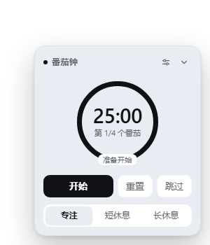

# Pomodoro Electron

A frameless, transparent, always-on-top Pomodoro widget for Windows, with a tray icon
and native notifications.

Built on Electron 44, rendered with React 18. The renderer is **not** produced by a
conventional frontend toolchain — `build.mjs` inlines the widget source and a React UMD
build **directly into one self-contained HTML file**, so there is no bundler and the
artifact is easy to audit.



[中文](README.md) · [MIT License](LICENSE)

---

## Features

### Timer

- **Focus / Short break / Long break** cycle, default 25 / 5 / 15 minutes, all configurable
- Configurable **long-break interval** (default: one long break every 4 pomodoros)
- Start / Pause / Resume / Reset / Skip
- **Auto-start next phase** can be turned off — phases then stop in an "idle" state and wait
- Three-tone chime synthesised with WebAudio at phase end — **no audio files required**
- Simultaneous Windows toast notification (silent, so it does not double up with the chime)

### Interaction rules

- **While running or paused, the phase buttons are disabled** — no bypassing the intended exits
- There are exactly two supported ways to change phase:
  - **Skip** — end the current phase and move on following the long-break cadence;
    a skipped focus session **still counts** toward the cycle
  - **Reset** — return to the idle state, which is **the only time** manual phase switching is allowed
- The subtitle `Session n/N` shows progress within the current cycle

### Window

- Frameless + transparent + always-on-top, **no taskbar entry**
- Drag the title bar to move; position and size are remembered
- Click **⌄** to collapse into a small pill — **the window shrinks with it**, so no invisible
  click-blocking rectangle is left behind
- When collapsed, **the pill itself is also a drag region**
- Click the **⌃** arrow to expand again (a native drag region receives no clicks, so the
  arrow is the only hit area)
- Dragging off-screen snaps back into the work area, always leaving part of it reachable

### Tray

| Menu item | Effect |
| --- | --- |
| Show / Hide widget | Left-clicking the tray icon does the same |
| Always on top | Turn off to make it an ordinary window |
| Launch at login | Writes the current user's startup entry |
| Quit | Really exits (closing the window does not) |

The tray tooltip shows live progress such as `番茄钟 · 专注 24:31`.

### Robustness

- A running timer **resumes after a refresh or restart** (an absolute deadline is persisted,
  not a remaining count)
- A syntax error in the inlined script **fails the build** instead of shipping a blank window
- Injected styles and timers are cleaned up on teardown

---

## Architecture

### Process model

```
┌──────────────── main process: main.js ───────────────────┐
│ BrowserWindow (frameless / transparent / alwaysOnTop)     │
│ Tray + Menu (show-hide / always-on-top / login / quit)    │
│ ipcMain: widget-size · tray-tooltip · notify              │
│ window-state.json: position & size (debounced writes)     │
└───────────────┬───────────────────────────────────────────┘
                │ contextBridge (exactly three narrow methods)
┌───────────────▼────────── preload.js ─────────────────────┐
│ window.pomodoroShell.{ reportSize, setTooltip, notify }   │
└───────────────┬───────────────────────────────────────────┘
                │
┌───────────────▼──── renderer/index.html (build output) ───┐
│ React 18 UMD (inlined)                                    │
│ + widget source src/widget.js (inlined)                   │
│ + design tokens src/tokens.mjs (inlined as CSS variables) │
│ ─ assembly: minimal ctx (slots / effect) → mount widget    │
│ ─ ResizeObserver measures the widget → reportSize          │
│ ─ subscribes to the store → tray tooltip / notifications   │
└────────────────────────────────────────────────────────────┘
```

### Key design decisions

**Why the renderer is "built" rather than a conventional frontend project**
The widget source `src/widget.js` is written as a CommonJS-style *factory body*; `build.mjs`
inlines it together with a React UMD build into a single HTML file. Upside: no bundler, no extra
toolchain, a self-contained artifact that is easy to audit. Downside: a syntax error in the
inlined script only surfaces at runtime — so the build parses the inlined script with
`new Function` as a guard.

**Why dragging uses `-webkit-app-region` instead of hand-rolled coordinates**
An earlier implementation sent pointer deltas over IPC and moved the window with `setBounds()`.
On Windows, moving a `transparent: true` layered window at high frequency makes the whole window
**flicker violently**. Native dragging removes the problem entirely and needs no per-frame IPC.
The trade-off: a drag region receives no `click`, so "expand" on the pill has to hang off a
`no-drag` child element (the ⌃ arrow).

**Why the window follows the widget's size**
The window is sized to the widget's measured size plus a 26 px margin and anchored to its
bottom-right corner. Collapsing therefore shrinks the window too, leaving no invisible
click-blocking area.

**Why the renderer writes a "ready" file**
"Process alive, window technically present, but nothing ever painted" cannot be detected from
process liveness. `renderer-ready.json` is the signal that the React tree really mounted and
measured itself; the end-to-end test keys off it.

**Why the state machine has three states, not two**
`idle` / `paused` / `running`. An earlier version folded "paused" into `idle`, so the UI could not
tell "paused" from "not started" and the phase buttons could not be disabled per state.

---

## Components used

| Component | Version | Role |
| --- | --- | --- |
| [Electron](https://www.electronjs.org/) | 44.x | Desktop runtime (Chromium + Node) |
| [React](https://react.dev/) / ReactDOM | 18.3.1 (UMD) | Rendering; inlined into the HTML at build time |
| [electron-builder](https://www.electron.build/) | 25.x | Packaging the portable directory build |
| [Pillow](https://python-pillow.org/) | any recent | Generates `icon.ico` / `tray.png` (only `npm run icons`) |
| Headless Chrome / Edge | any recent | Automated DOM tests (tests only) |

**There are no third-party npm runtime dependencies** — only what Electron ships.

---

## Project layout

```
Pomodoro-Electron/
├─ package.json            # dependencies, scripts, electron-builder config
├─ main.js                 # main process: window, tray, IPC, window-state persistence
├─ preload.js              # contextBridge exposing exactly three narrow methods
├─ build.mjs               # generates renderer/index.html (React + widget + tokens inlined)
├─ make-icons.py           # draws icon.ico / icon.png / tray.png with Pillow
├─ LICENSE                 # MIT
├─ src/
│  ├─ widget.js            # single source of truth: timer engine + widget UI + styles
│  └─ tokens.mjs           # design tokens: light / dark CSS variable sets
├─ scripts/
│  ├─ verify-all.mjs       # one command: build + all tests + package + launch check
│  ├─ dom-test.mjs         # real-browser test of the widget itself (26 checks)
│  └─ dom-test-desktop.mjs # real-browser test of the desktop drag contract (9 checks)
├─ assets/                 # app and tray icons (generated by make-icons.py, committed)
├─ renderer/               # build output: index.html (gitignored)
└─ dist/                   # package output: win-unpacked/Pomodoro.exe (gitignored)
```

---

## Build and package

### Requirements

- **Node.js ≥ 20** (developed on 24)
- **Windows 10 / 11 x64**
- Optional: Python + Pillow (only to regenerate icons)
- Optional: Chrome / Edge (only to run the DOM tests)

### Commands

```bash
npm install        # installs Electron 44 and the packaging toolchain
npm run icons      # optional: regenerate icons
npm start          # build the renderer and run it (development)
npm run dist            # package as a portable directory → dist/win-unpacked/Pomodoro.exe
npm run dist:portable   # package as one single file   → dist/Pomodoro-1.0.0-portable.exe
```

Both artifacts run by double-clicking:

| Artifact | Shape | Start-up | Notes |
| --- | --- | --- | --- |
| `dist/win-unpacked/Pomodoro.exe` | a folder | fast | for daily use; the whole folder can be copied to any pure-ASCII directory |
| `dist/Pomodoro-1.0.0-portable.exe` | **one exe, ~98 MB** | a few seconds slower | self-extracts the runtime into `%TEMP%` on every launch; good for carrying around |

A mirror is recommended in mainland China; otherwise the ~158 MB Electron binary is fetched
straight from GitHub and is slow:

```powershell
$env:ELECTRON_MIRROR="https://npmmirror.com/mirrors/electron/"
$env:ELECTRON_BUILDER_BINARIES_MIRROR="https://npmmirror.com/mirrors/electron-builder-binaries/"
```

### Tests

```bash
npm test                                    # the two real-browser DOM tests
npm run verify                              # build + all tests
npm run smoke                               # all of the above + package + actually launch the exe
node scripts/verify-all.mjs --deploy D:\Tools\Pomodoro   # package and copy to a target directory
```

`--smoke-app` launches the packaged exe, waits for the renderer to report that it mounted, then
closes it — the only reliable automated signal for blank-window failures.

---

## Usage

1. Double-click `dist/win-unpacked/Pomodoro.exe` (or the directory copied by `--deploy`)
2. The widget appears at the **bottom-right** of the screen, always on top
3. **Drag the title bar** to move it; click **⌄** to collapse it into a pill
4. Click the **⌃** arrow to expand again; drag the pill itself to move the window
5. **Right-click the tray icon**: show/hide, always on top, launch at login, quit

> Closing the window does **not** quit the app (the tray keeps it alive). Use **Quit** in the
> tray menu to really exit.

---

## Known limitations

- **The executable must live on a pure-ASCII path**; the single-file build additionally requires
  `%TEMP%` to be pure-ASCII, since that is where it self-extracts.
  Chromium's sandbox fails to initialise when the executable path contains non-ASCII
  characters; the process exits silently with `STATUS_BREAKPOINT (0x80000003)` — which looks
  exactly like "I double-clicked and nothing happened". This is a Chromium limitation and
  cannot be worked around in application code.
- The build is **not code-signed**. Windows SmartScreen may warn about an unknown publisher on
  first run; choose "More info → Run anyway".
- The single-file `portable` build self-extracts roughly 200 MB of runtime into `%TEMP%` on every
  launch, so it starts a few seconds slower than the directory build; NSIS cleans the temporary
  directory up on exit.
- When collapsed, **clicking the pill body does not expand it** (that area is a native drag
  region and receives no clicks) — use the ⌃ arrow.
- Verified on **Windows x64** only; the code is cross-platform, but the tray and packaging
  configuration have only been exercised on Windows.
- The timer advances on system time; the window is always visible, so there is no background
  throttling problem of the kind browser tabs have.

---

## License

[MIT](LICENSE)

Packaged builds bundle Electron / Chromium under their respective open-source licences
(see `LICENSE.electron.txt`). React / ReactDOM are MIT, copyright Meta Platforms, Inc. and
affiliates.
